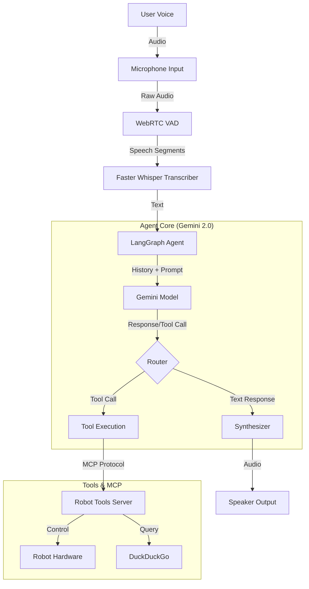

# Open Droids R2D3 Voice Agent (Senses MCP)

A robust, always-on voice agent designed for the **Jetson Orin AGX**, powered by **Gemini 2.0 Flash Exp** and **LangGraph**. This project integrates real-time speech-to-text, text-to-speech, and a local **Model Context Protocol (MCP)** server to control robot hardware and perform web searches.

## 🚀 Features

-   **Advanced LLM Brain**: Uses Google's **Gemini 2.0 Flash Exp** for multimodal understanding and fast responses.
-   **Agentic Workflow**: Orchestrated by **LangGraph** for robust state management and tool execution loops.
-   **Real-time Voice Interaction**:
    -   **STT**: Local transcription using `faster-whisper` with WebRTC VAD for precise voice detection.
    -   **TTS**: High-quality neural voices via `edge-tts` with `gTTS` fallback.
-   **Hardware Control via MCP**: A local MCP server exposes robot capabilities (Camera, Base Movement, Head Movement) to the agent.
-   **Web Intelligence**: Integrated DuckDuckGo search (`ddgs`) for real-time information retrieval.
-   **Custom Persona**: "R2D3" - An optimistic, open-source focused droid assistant.
-   **Cross-Platform**: Optimized for Jetson Orin (ARM64) but compatible with x86_64 systems.

## 🏗️ Architecture

The system follows a modular pipeline architecture:



## 🛠️ Prerequisites

-   **Hardware**: NVIDIA Jetson Orin AGX (recommended) or Linux PC.
-   **OS**: Ubuntu 20.04/22.04.
-   **Python**: 3.10+.
-   **API Keys**: Google Gemini API Key.

## 📦 Installation

1.  **Clone the repository**
    ```bash
    git clone https://github.com/yourusername/senses-mcp.git
    cd senses-mcp
    ```

2.  **Set up Virtual Environment**
    ```bash
    python3 -m venv .venv
    source .venv/bin/activate
    ```

3.  **Install Dependencies**
    ```bash
    pip install -r requirements.txt
    ```
    *(Note: Ensure you have system dependencies for `pyaudio` and `gstreamer` if needed).*

4.  **Configure Environment**
    Create a `.env` file in the root directory:
    ```ini
    GOOGLE_API_KEY=your_gemini_api_key_here
    GEMINI_MODEL=gemini-2.0-flash-exp
    ```

## 🚀 Usage

1.  **Start the Agent**
    This command launches the MCP server, initializes the audio subsystem, and connects to Gemini.
    ```bash
    python src/agent.py
    ```

2.  **Interaction**
    -   Speak clearly into the microphone.
    -   The agent will detect speech, transcribe it, and respond.
    -   **Commands**: You can ask R2D3 to:
        -   "Move forward at 0.5 meters per second."
        -   "Look up 20 degrees."
        -   "Take a picture."
        -   "Search the web for the latest robotics news."

## 📂 Project Structure

```
senses-mcp/
├── src/
│   ├── agent.py              # Main entry point & LangGraph orchestration
│   ├── audio_manager.py      # Microphone input & VAD handling
│   ├── robot_tools_server.py # MCP Server implementation (Tools)
│   ├── synthesizer.py        # TTS logic (EdgeTTS/gTTS)
│   └── transcriber.py        # STT logic (Faster Whisper)
├── persona.txt               # System instructions & personality definition
├── requirements.txt          # Python dependencies
├── visualize_graph.py        # Utility to generate graph diagrams
└── .env                      # Configuration secrets
```

## 🤖 Persona: R2D3

The agent embodies **R2D3**, a persona defined in `persona.txt`.
-   **Traits**: Optimistic, Curious, Sarcastic, Helpful.
-   **Philosophy**: "Skillnet > Skynet" (Focus on open collaboration).
-   **Voice**: Natural, conversational, avoiding generic "robot" sounds.

## 🤝 Contributing

Contributions are welcome! Please ensure you ignore the `tests/` directory as per the `.gitignore` rules.

## 📄 License

[MIT License](LICENSE)
