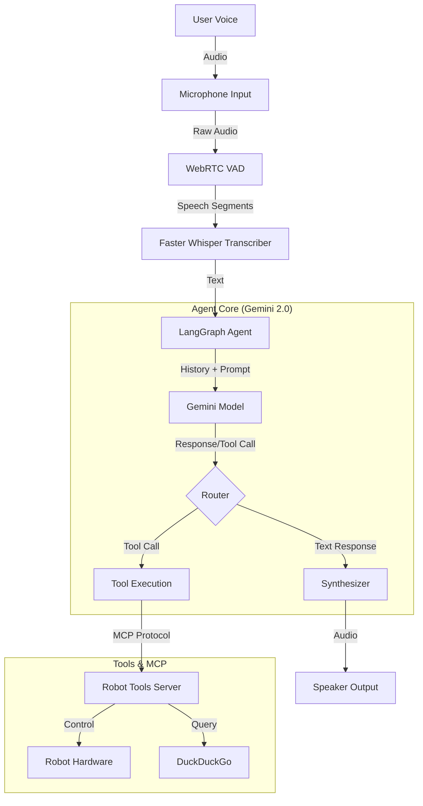

# Open Droids R2D3 Voice Agent (Senses MCP)

A robust, always-on voice agent designed for the **Jetson Orin AGX**, powered by **Gemini 2.0 Flash Exp** and **LangGraph**. This project integrates real-time speech-to-text, text-to-speech, and a local **Model Context Protocol (MCP)** server to control robot hardware and perform web searches.

## 🚀 Features

-   **Advanced LLM Brain**: Uses Google's **Gemini 2.0 Flash Exp** for multimodal understanding and fast responses.
-   **Scene Understanding**: Powered by **Gemini Robotics ER** for visual reasoning, object detection, spatial analysis, and trajectory planning.
-   **Agentic Workflow**: Orchestrated by **LangGraph** for robust state management and tool execution loops.
-   **Observability**: Integrated **Weave** for tracing and logging agent interactions (agent_v2.py).
-   **Real-time Voice Interaction**:
    -   **STT**: Local transcription using `faster-whisper` with WebRTC VAD for precise voice detection.
    -   **TTS**: High-quality neural voices via `edge-tts` with `gTTS` fallback.
-   **Hardware Control via MCP**: A local MCP server exposes robot capabilities (Camera, Base Movement, Head Movement) to the agent.
-   **Web Intelligence**: Integrated DuckDuckGo search (`ddgs`) for real-time information retrieval.
-   **Custom Persona**: "R2D3" - An optimistic, open-source focused droid assistant.
-   **Cross-Platform**: Optimized for Jetson Orin (ARM64) but compatible with x86_64 systems.

## 🏗️ Architecture

The system follows a modular pipeline architecture:



## 🛠️ Prerequisites

-   **Hardware**: NVIDIA Jetson Orin AGX (recommended) or Linux PC.
-   **OS**: Ubuntu 20.04/22.04.
-   **Python**: 3.10+.
-   **API Keys**: Google Gemini API Key.
-   **Optional**: Weave account for observability.

## 📦 Installation

1.  **Clone the repository**
    ```bash
    git clone https://github.com/yourusername/senses-mcp.git
    cd senses-mcp
    ```

2.  **Set up Virtual Environment**
    ```bash
    python3 -m venv .venv
    source .venv/bin/activate
    ```

3.  **Install Dependencies**
    ```bash
    pip install -r requirements.txt
    ```
    *(Note: Ensure you have system dependencies for `pyaudio` and `gstreamer` if needed).*

4.  **Configure Environment**
    Create a `.env` file in the root directory:
    ```ini
    GOOGLE_API_KEY=your_gemini_api_key_here
    GEMINI_MODEL=gemini-2.0-flash-exp
    ```

## 🚀 Usage

1.  **Start the Agent**
    This command launches the MCP server, initializes the audio subsystem, and connects to Gemini.
    
    python src/agent.py
        
    Or use the new version with Weave tracing:
    python src/agent_v2.py

2.  **Interaction**
    -   Speak clearly into the microphone.
    -   The agent will detect speech, transcribe it, and respond.
    -   **Commands**: You can ask R2D3 to:
        -   "Move forward at 0.5 meters per second."
        -   "Look up 20 degrees."
        -   "Take a picture."
        -   "Search the web for the latest robotics news."
        -   **"What objects do you see?"** (Scene Understanding Mode)
        -   **"Plan a trajectory to reach that cup."** (Trajectory Planning)

## 🎯 Scene Understanding Mode

The agent can switch into **Scene Understanding Mode** when visual reasoning is needed. This mode uses Gemini Robotics ER to:

- Detect and locate objects in the camera view
- Analyze spatial relationships
- Generate reachability checks
- Plan movement trajectories

Visualization outputs are saved to the `outputs/` directory with timestamps:
- `captured_image_*.jpg` - Raw camera captures
- `detection_vis_*.jpg` - Object detection visualizations
- `trajectory_vis_*.jpg` - Trajectory planning visualizations

## �� Observability with Weave

The `agent_v2.py` version includes **Weave** integration for comprehensive tracing and observability of agent interactions. Weave automatically captures:

- **Tool Execution**: All MCP tool calls and their results
- **Image Captures**: Camera images and visualization outputs are logged to traces
- **Conversation Flow**: Complete interaction history with the LLM
- **Function Calls**: Detailed tracking of agent decision-making

### Setup

1. **Install Weave** (already included in `requirements.txt`):
2. **Initialize Weave** (optional - runs automatically in `agent_v2.py`):n
3. **View Traces**:
- Traces are automatically sent to Weave's cloud service
- Visit [wandb.ai](https://wandb.ai) to view your traces (Weave is built on Weights & Biases)
- You can also run a local Weave server for private tracing

### What Gets Traced

- **`tool_node()`**: Every tool execution (camera captures, web searches, robot movements)
- **`process()`**: Main conversation processing with full context
- **Images**: Camera captures and visualization outputs (`detection_vis_*.jpg`, `trajectory_vis_*.jpg`)

### Usage

Simply run `agent_v2.py` instead of `agent.py`:
python src/agent_v2.pyAll interactions will be automatically traced. You can view the traces in the Weave dashboard to debug agent behavior, analyze tool usage patterns, and optimize the agent's decision-making process.

## �� Project Structure

```
senses-mcp/
├── src/
│   ├── agent.py              # Main entry point & LangGraph orchestration
│   ├── agent_v2.py           # New agent version with Weave tracing
│   ├── audio_manager.py      # Microphone input & VAD handling
│   ├── robot_tools_server.py # MCP Server implementation (Tools)
│   ├── synthesizer.py        # TTS logic (EdgeTTS/gTTS)
│   └── transcriber.py        # STT logic (Faster Whisper)
├── persona.txt               # System instructions & personality definition
├── requirements.txt          # Python dependencies
├── visualize_graph.py        # Utility to generate graph diagrams
└── .env                      # Configuration secrets
```

## 🤖 Persona: R2D3

The agent embodies **R2D3**, a persona defined in `persona.txt`.
-   **Traits**: Optimistic, Curious, Sarcastic, Helpful.
-   **Philosophy**: "Skillnet > Skynet" (Focus on open collaboration).
-   **Voice**: Natural, conversational, avoiding generic "robot" sounds.

## 🤝 Contributing

Contributions are welcome! Please ensure you ignore the `tests/` directory as per the `.gitignore` rules.

## 📄 License

[MIT License](LICENSE)
